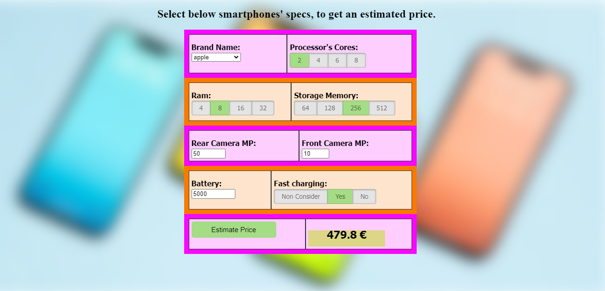

# Smartphone Price Prediction with XGBoost

### Here is an "End to End" Machine Learning project in order to predict the price of a smartphone from its specs. The whole project begins from a CSV file and ends at an online web app. All these with the help of [codebasics'](https://github.com/codebasics)  [GitHub repository](https://github.com/codebasics/py/blob/master/DataScience/BangloreHomePrices) and [YouTube series](https://www.youtube.com/playlist?list=PLeo1K3hjS3ut2o1ay5Dqh-r1kq6ZU8W0M).

>You can use my app on this [link](http://ec2-16-170-255-26.eu-north-1.compute.amazonaws.com/).

The process is described below:

1. On a jupyter notebook I get the data, analyze and preproccess them. Then I built an XGBoostReggresor and hyperparameterize it. For these proccesses I used ```numpy```, ```pandas```, ```sci-kit learn``` and ```xgboost``` python libraries. The jupyter notebook and enviroment's requirements are in *model* folder.
2. I built the app server with ```Flask``` python library. *server* folder contains the files for app server (api and requirements).
3. I built the web server with ```HTML```, ```javascript``` and ```CSS```, which is served from ```nginx``` server. *client* folder contains these files.
4. Finaly, I deploy the project on an ```EC2 Amazon Server```. So, anyone can use the trained model visiting the [link](http://ec2-16-170-255-26.eu-north-1.compute.amazonaws.com/).